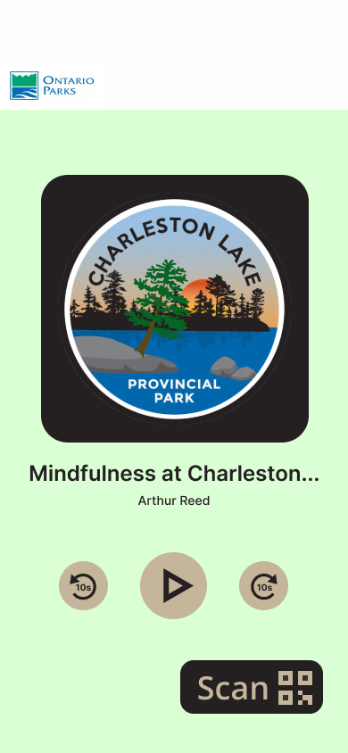
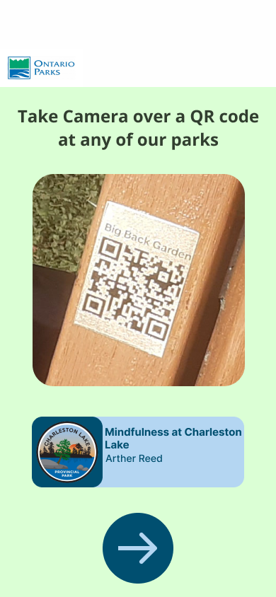
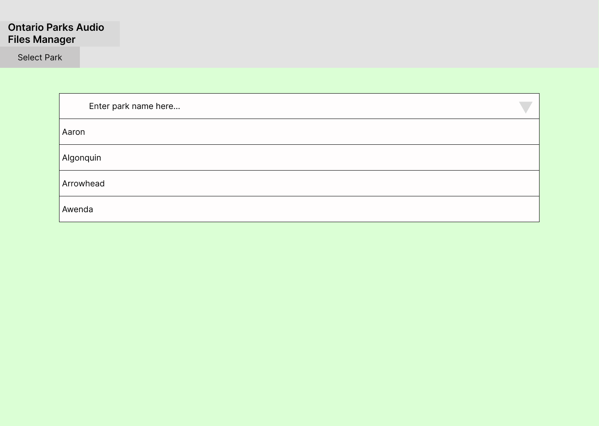
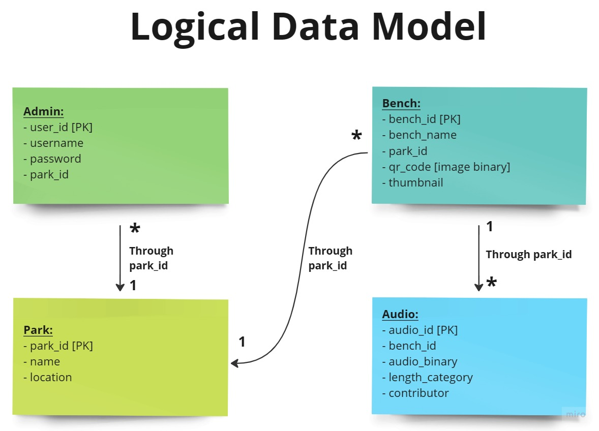
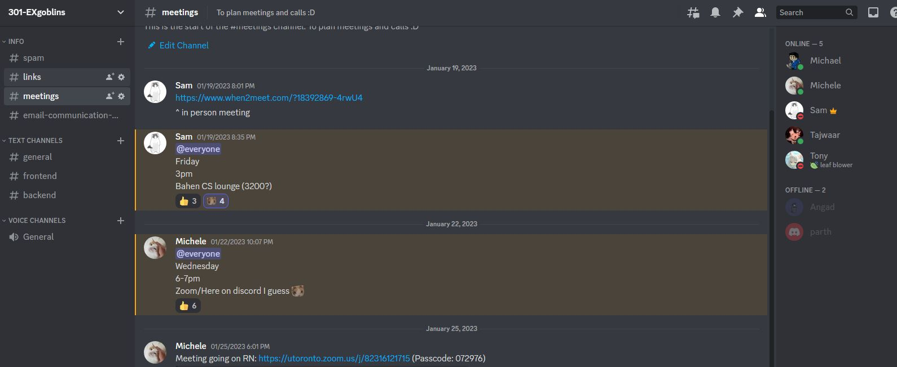

# Park Mindfulness - EXgoblins

<!-- > _Note:_ This document will evolve throughout your project. You commit regularly to this file while working on the project (especially edits/additions/deletions to the _Highlights_ section). 
 > **This document will serve as a master plan between your team, your partner and your TA.** -->

## Product Details
 
## Q1: What is the product?

 <!-- > Short (1 - 2 min' read)
 * Start with a single sentence, high-level description of the product.
 * Be clear - Describe the problem you are solving in simple terms.
 * Specify if you have a partner and who they are.
 * Be concrete. For example:
    * What are you planning to build? Is it a website, mobile app, browser extension, command-line app, etc.?      
    * When describing the problem/need, give concrete examples of common use cases.
    * Assume your the reader knows nothing about the partner or the problem domain and provide the necessary context. 
 * Focus on *what* your product does, and avoid discussing *how* you're going to implement it.      
   For example: This is not the time or the place to talk about which programming language and/or framework you are planning to use.
 * **Feel free (and very much encouraged) to include useful diagrams, mock-ups and/or links**. -->
 
 
 A website to support guided meditation in Ontario Parks based on a user's geolocation.
 
 Forest Therapy is a practice that started in the 1980s combining mindfulness and meditation with nature, and through Park Mindfulness, we plan on extending health care into Ontario Parks by helping people (our users) access Forest Therapy to cope with stress, depression, and other related mental health conditions.

 Our partner throughout this project will be Ontario Parks, and John Leadston will be serving as their representative to bring this innovative mental health strategy into life.

 More specifically, the plan is to lay out a series of QR codes in benches throughout popular parks in Ontario, and map them to location specific audio clips that will help a person access a guided meditation session based on their location within the park upon scanning the QR code using our website or their phone's camera (which both lead to the same endpoint). Along with this, we also have to make an access point for park managers to upload and modify the audio files that these QR codes will map to based on the location, season, specific park and more.

 ### Mockups

User side


    

 Manager side


    


## Q2: Who are your target users?

  <!-- > Short (1 - 2 min' read max)
 * Be specific (e.g. a 'a third-year university student studying Computer Science' and not 'a student')
 * **Feel free to use personas. You can create your personas as part of this Markdown file, or add a link to an external site (for example, [Xtensio](https://xtensio.com/user-persona/)).** -->

 The target users for this website are new Canadians coming to John's (our partner's) parks with the idea of leaving the parks in a better place than when they came in.
<should include links to specific personas we make during the meeting>

## Q3: Why would your users choose your product? What are they using today to solve their problem/need?

<!-- > Short (1 - 2 min' read max)
 * We want you to "connect the dots" for us - Why does your product (as described in your answer to Q1) fits the needs of your users (as described in your answer to Q2)?
 * Explain the benefits of your product explicitly & clearly. For example:
    * Save users time (how and how much?)
    * Allow users to discover new information (which information? And, why couldn't they discover it before?)
    * Provide users with more accurate and/or informative data (what kind of data? Why is it useful to them?)
    * Does this application exist in another form? If so, how does your differ and provide value to the users?
    * How does this align with your partner's organization's values/mission/mandate? -->

Nowadays there is nothing quite like this product out in the world. Park Mindfulness is meant to bridge the gap between people that want to meditate and connect with nature without the need of being an expert in mindfulness and meditation.

Before Park Mindfulness, people could go onto youtube or any of the multiple mindfulness applications to access meditation guidance during their visits to the parks; but with our website, everything is laid out for them, saving the users the time of looking for the perfect video, and providing a detailed and context-specific meditation session (unique based on your location within the park) that a generic meditation video or app could not provide. This would include tailored audio recordings for the specific QR Code placed on a bench that would be dependent on its surroundings. Additionally, this would also save time as users would not need to filter/scroll through search results finding an appropriate video/audio recording to use within their meditation.

## Q4: What are the user stories that make up the Minumum Viable Product (MVP)?

 <!-- * At least 5 user stories concerning the main features of the application - note that this can broken down further
 * You must follow proper user story format (as taught in lecture) ```As a <user of the app>, I want to <do something in the app> in order to <accomplish some goal>```
 * User stories must contain acceptance criteria. Examples of user stories with different formats can be found here: https://www.justinmind.com/blog/user-story-examples/. **It is important that you provide a link to an artifact containing your user stories**.
 * If you have a partner, these must be reviewed and accepted by them. You need to include the evidence of partner approval (e.g., screenshot from email) or at least communication to the partner (e.g., email you sent)

 <Need to make up user stories> -->
 The main functionalities of the Minimum Viable Product as presented to use by our partner John Leadston can be described through the following user stories:
 
 * As a user, I want to be able to scan the QR codes on Ontario Park benches, so that I can access the content behind them.
 * As a user, I want to be able to play the media related to a benche's QR code, so that I can be guided through the context-specific meditation session.
 * As a Park Manager, I want to be able to create an account for the website and log into it, so that I can get access to priviledged actions (such as the ones in the following bullet points).
 * As a logged in Park Manager, I want to be able to make up new bench objects for my park within the website, so that I can upload a corresponding audio recording and get a QR code to place on the physical park bench that will guide users to the uploaded audio clip.
 * As a logged in Park Manager, I want to be able to obtain the QR code corresponding to an existing bench, so that in the case of damages being caused to the existing printed version, I can replace it with a working one.
 * As a logged in Park Manager, I want to be able to update the audio-to-QR Code mapping on an existing bench (assign a new audio recording to an existing bench with a QR code in the system), so that I can cycle between themes in these recording based on the season and other special factors (to achieve a more personalized experience for the user). 

 <!-- * user wants to find general information by using the camera on the website
 * user wants to access a context-specific audio recording (using their camera app and the QR Code)
 * new manager wants to create an account and change an audio recording for an existing bench for seasonal changes
 * existing manager wants to make a new bench and upload a context-specific audio recording and obtain a QR Code for it
 * existing manager wants to obtain the QR Code for an existing bench due to damages caused to a bench's printed version -->
 

## Q5: Have you decided on how you will build it? Share what you know now or tell us the options you are considering.

<!-- > Short (1-2 min' read max)
 * What is the technology stack? Specify languages, frameworks, libraries, PaaS products or tools to be used or being considered. 
 * How will you deploy the application?
 * Describe the architecture - what are the high level components or patterns you will use? Diagrams are useful here. 
 * Will you be using third party applications or APIs? If so, what are they? -->

For our application, we will be using the following languages/frameworks for our tech stack:

* Backend: Python (Django), SQLite3
* Frontend: HTML, CSS, and React
  * Potential APIs: `react-qr-reader` for QR Code reading, `qr-code` for QR Code creation, and libraries for camera usage within a website (TBD)
* Deployment: TBD with partner as we near the deployment stage.
<!-- * Helpful Diagrams: -->
In terms of the design and architecture, the following Logical Data Model, showcases our entities and their relationships:



----
## Intellectual Property Confidentiality Agreement 
<!-- > Note this section is **not marked** but must be completed briefly if you have a partner. If you have any questions, please ask on Piazza.
>  
**By default, you own any work that you do as part of your coursework.** However, some partners may want you to keep the project confidential after the course is complete. As part of your first deliverable, you should discuss and agree upon an option with your partner. Examples include:
1. You can share the software and the code freely with anyone with or without a license, regardless of domain, for any use.
2. You can upload the code to GitHub or other similar publicly available domains.
3. You will only share the code under an open-source license with the partner but agree to not distribute it in any way to any other entity or individual. 
4. You will share the code under an open-source license and distribute it as you wish but only the partner can access the system deployed during the course.
5. You will only reference the work you did in your resume, interviews, etc. You agree to not share the code or software in any capacity with anyone unless your partner has agreed to it. -->

We have agreed with our partner John Leadston to stick to the standards of option 5, allowing us to reference the work produced in our resumes and more, while keeping the code and software private (not available to the public), as this will be just a starting point for a bigger project that the partner wants jurisdiction over when presenting it to higher ups.

<!-- Skip two lines here -->
&nbsp;
&nbsp;
&nbsp;


# Teamwork Details

## Q6: Have you met with your team?

<!-- Do a team-building activity in-person or online. This can be playing an online game, meeting for bubble tea, lunch, or any other activity you all enjoy.
* Get to know each other on a more personal level.
* Provide a few sentences on what you did and share a picture or other evidence of your team building activity.
* Share at least three fun facts from members of you team (total not 3 for each member). -->


## Q7: What are the roles & responsibilities on the team?

<!-- Describe the different roles on the team and the responsibilities associated with each role. 
 * Roles should reflect the structure of your team and be appropriate for your project. One person may have multiple roles.  
 * Add role(s) to your Team-[Team_Number]-[Team_Name].csv file on the main folder.
 * At least one person must be identified as the dedicated partner liaison. They need to have great organization and communication skills.
 * Everyone must contribute to code. Students who don't contribute to code enough will receive a lower mark at the end of the term.

List each team member and:
 * A description of their role(s) and responsibilities including the components they'll work on and non-software related work
 * Why did you choose them to take that role? Specify if they are interested in learning that part, experienced in it, or any other reasons. Do no make things up. This part is not graded but may be reviewed later. -->
 Different roles:
  * Frontend-User Developer: we plan to have 2 frontends. 1 for the user to view. The other is for the manager to use.
  * Frontend-Manager: this is the frontend that the manager will use to upload audio recordings and create new benches.
  * Backend: this is the backend that will be used to store the audio recordings and the QR Codes.

Members:
 * Parth
   - Role: Frontend-User Developer, UI/UX designer.
   - Parth has a lot of experience in frontend user development hence we have chosen him to be a frontend user developer. He is also good with visual design choices and is interested in learning more about UI/UX design so we have chosen him to be the UI/UX designer.
 * Tony - Frontend-User
 * Angad - Frontend-Manager
 * Michael 
    - Role: Frontend-Manager (Team Liason + Co-rep)
    - Michael has experience in frontend development in other software development courses and projects, and is interested in expanding on those skills. He is confident in communication and volunteered to be co-rep and team liason.
 * Tajwaar - Backend
 * Samantha - Backend
 * Michele
   - Role: Backend, Co-rep/PM.
   - Michele has a lot of experience with logically designing and carrying out the execution of backend development for multiple personal and school projects. Additionally, he has lead his respective teams in other software development courses (CSC207 & CSC309) to successful results. Therefore, we have made the choice of picking him as a Co-representative along with Michael, and a backend developer to be the direct connection between the client and the backend.


## Q8: How will you work as a team?

<!-- Describe meetings (and other events) you are planning to have. 
 * When and where? Recurring or ad hoc? In-person or online?
 * What's the purpose of each meeting?
 * Other events could be coding sessions, code reviews, quick weekly sync meeting online, etc.
 * You should have 2 meetings with your project partner (if you have one) before D1 is due. Describe them here:
   * You must keep track of meeting minutes and add them to your repo under "documents/minutes" folder
   * You must have a regular meeting schedule established for the rest of the term.   -->
  
## Q9: How will you organize your team?

<!-- List/describe the artifacts you will produce in order to organize your team.       

 * Artifacts can be To-Do lists, Task boards, schedule(s), meeting minutes, etc.
 * We want to understand:
   * How do you keep track of what needs to get done? (You must grant your TA and partner access to systems you use to manage work)
   * **How do you prioritize tasks?**
   * How do tasks get assigned to team members?
   * How do you determine the status of work from inception to completion? -->

## Q10: What are the rules regarding how your team works?

<!-- **Communications:**
 * What is the expected frequency? What methods/channels will be used? 
 * If you have a partner project, what is your process for communicating with your partner?
 
**Collaboration: (Share your responses to Q8 & Q9 from A1)**
 * How are people held accountable for attending meetings, completing action items? Is there a moderator or process?
 * How will you address the issue if one person doesn't contribute or is not responsive?  -->

Communications:
 * We make use of a discord server on the daily to plan out meetings, ask questions, and collaborate on all aspects of the project. Attached is a screenshot of such server:



 * In terms of meetings, the entire group meets every Saturday from 3-4pm, and every Thursday during our tutorial slot to discuss current goals, how work is going and device a plan for the next couple of days. We also make use of the discord voice channels for quick calls between specific sub-team members.
 * We also have a scheduled bi-weekly meeting with our partner from Ontario Parks John Leadston that takes place on Thurdays from 2-3pm.

Collaboration:
 * As discord is our primary form of contact, we will keep each other accountable on discord where we regularly update each other with what we have done and sending reminders to each other for meetings and completing tasks.
 * If a person is not responsive or is not contributing, our primary plan is to keep them updated by updating meeting minutes and our own statuses so that they can catch up easily. If we have contacted them through different channels like discord mentions, email, and they are still not responsive, since our roles are well documented then in an emergency we would able to fill in for their responsibilities.
 
